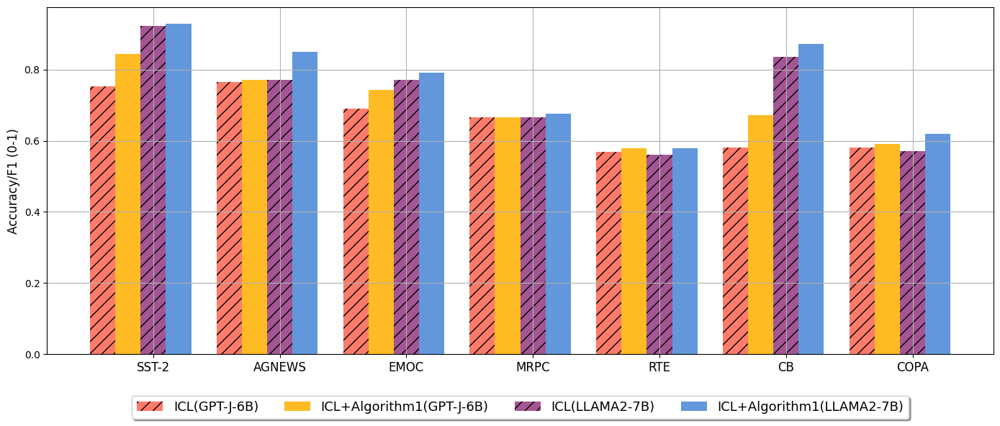
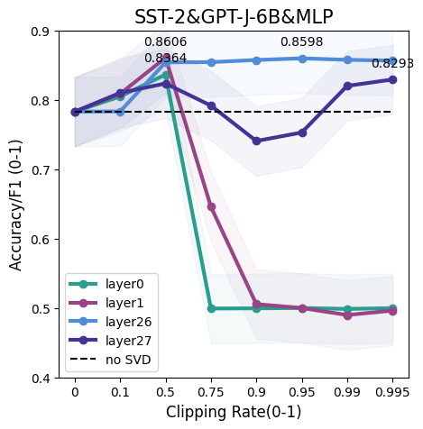

# EnhancingICL_SVDPruning

This repository contains code for the paper： 

Enhancing In-Context Learning Performance with just SVD-Based Weight Pruning: A Theoretical Perspective



## Requirements

To install the experiment, please install the pip file. 

```setup
pip install -r requirements.txt
```

## **Run a sample code**

At the moment, each setup is its own file. You can run the following example:

```eval
python data_gptj_cb.py
```

>📋  You can modify some parameter settings in the code to conduct different experiments.
>
>\# ['k_proj', 'q_proj', 'v_proj', 'out_proj', 'fc_in', 'fc_out', 'all', 'mlp', 'attn']
>
>l_name = "mlp" #predefined module
>
>\# list(range(-1, 27)) 
>
>l_num = 26 #selected layer
>
>rates = [0,1.0,5.0,7.5,9.0,9.5,9.9,9.95] #predefined clipping rate candidates
>
>demo_size = 5 #shot number
>
>eval_data_size = 200 # the size of validation set for searching optimal rate.


## Contributing

>📋  we show our surprising findings in ICL inference: SVD-based weight pruning can enhance ICL performance both in shallow and deep layers across different module types, and pruning weights in deep layers often results in more stable performance improvements in shallow layers.  Besides,  we intuitively propose a derivative-free and effective method for downstream tasks in enhancing ICL inference.


